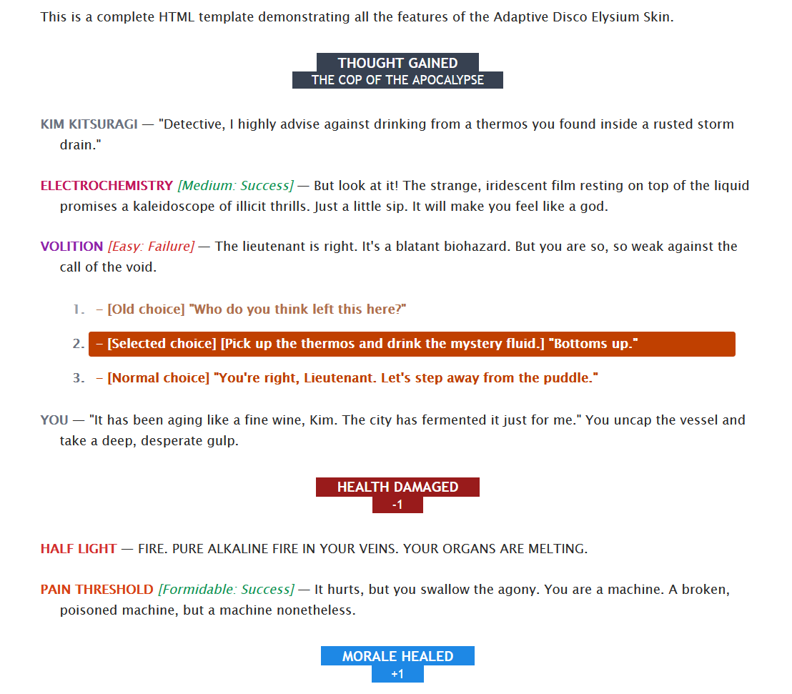

# The Voices in Your Head: Adaptive Disco Elysium Work Skin

A lightweight AO3 work skin inspired by Disco Elysium's iconic skill system. It brings the game's signature colours and formatting into your fic while staying readable across light mode, Ao3Reversi theme, desktop, and mobile. Less "perfect UI recreation," more "what if your fic had intrusive thoughts in colour."

---

## Connect with me

**Support this project:** [Buy me a coffee on Ko-fi](https://ko-fi.com/ninineen)

I make AO3 skins, stream on Twitch, and post fandom content across socials. Find me here:

<p align="left">
  <a href="https://archiveofourown.org/users/ninineen/profile" target="_blank"></a>
  <a href="https://twitch.tv/ninineen" target="_blank"></a>
  <a href="https://bsky.app/profile/ninineen.bsky.social" target="_blank"></a>
  <a href="https://ko-fi.com/ninineen" target="_blank"></a>
  <a href="https://discord.gg/ninineen" target="_blank"></a>
</p>


## What's in this repo

```
de-fanfic/
├── skin/
│   └── deworkskin.css               ← the only file you need to install
├── ao3-post/
│   ├── metadata.md                  ← title, summary, and author's note for the AO3 post
│   ├── chapter-01-demo.html         ← full working demo of all features
│   ├── chapter-02-html-guide.html   ← HTML usage examples with copy-paste snippets
│   ├── chapter-03-css-guide.html    ← CSS structure walkthrough
│   └── chapter-04-reference.html   ← full class reference
└── reference/
    └── colors.md                    ← hex codes for all 24 skills + primal voices
```

---

## Live demo

**[Read the demo fic on AO3 →](https://archiveofourown.org/works/86984576/chapters/230306496)**

<p align="center"><a href="https://archiveofourown.org/works/86984576/chapters/230306496"></a></p>

---

## How to install

1. Go to **AO3 → Fanworks → My Skins** and create a new Work Skin.
2. Copy the contents of [`skin/deworkskin.css`](skin/deworkskin.css) into the CSS field and save.
3. Apply the skin to your work, then switch your chapter editor to **HTML mode** and use the classes below.

---

## Class reference

### Conversation lines

```html
<p class="de-convo">
  <span class="de-speaker">KIM KITSURAGI</span> — "Your line of dialogue."
</p>
```

| Class | What it does |
|---|---|
| `de-convo` | Hanging-indent paragraph for dialogue lines |
| `de-speaker` | Bold, uppercase, neutral grey speaker name |
| `de-skill SKILLNAME` | Bold, uppercase skill name in that skill's colour |
| `de-check success` | Italic green text for a passed check |
| `de-check failure` | Italic red text for a failed check |

### Skill colours

Use as `<span class="de-skill SKILLNAME">SKILL NAME</span>`.

**Intellect** — `logic` · `encyclopedia` · `rhetoric` · `drama` · `conceptualization` · `visual-calculus`

**Psyche** — `volition` · `inland-empire` · `empathy` · `authority` · `esprit-de-corps` · `suggestion`

**Physique** — `endurance` · `pain-threshold` · `physical-instrument` · `electrochemistry` · `shivers` · `half-light`

**Motorics** — `hand-eye-coordination` · `perception` · `reaction-speed` · `savoir-faire` · `interfacing` · `composure`

**Primal Voices** — `ancient-reptilian-brain` · `limbic-system`

### Alert banners

```html
<p class="de-alert thought">
  <span>Thought Gained</span>
  <span>The Cop of the Apocalypse</span>
</p>
```

| Modifier | Colour | Use for |
|---|---|---|
| `thought` | Dark charcoal | Thought cabinet entries |
| `health-up` | Orange-red | Health restored |
| `health-down` | Dark red | Health damaged |
| `morale-up` | Blue | Morale restored |
| `morale-down` | Purple | Morale damaged |
| `success` | Green | Skill check passed |
| `failure` | Red | Skill check failed |

### Player choices

```html
<ol class="de-choices">
  <li>Say the thing you'll regret.</li>
  <li>Say the other thing you'll also regret.</li>
</ol>
```

Renders as an orange numbered list styled like the in-game dialogue wheel. Desktop readers get a hover state.

---

## Colour reference


Full hex codes and descriptions for all 24 skills and the two primal voices are in [`reference/colors.md`](reference/colors.md).

---

## License

**License: Creative Commons Zero v1.0 Universal (CC0)**

Free to use and modify. Credit appreciated but not required — a link back to the original AO3 skin post is always welcome. Not affiliated with ZA/UM.

This work skin is released into the public domain. You are free to use, modify, and distribute it for any purpose, with or without attribution. No warranties are provided.

For the full legal text, see https://creativecommons.org/publicdomain/zero/1.0/

---