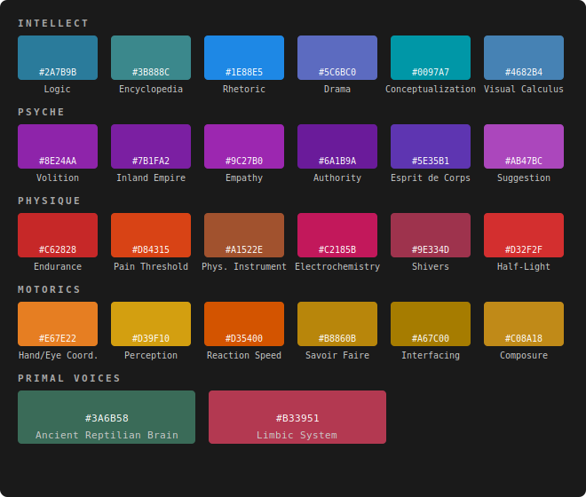

---

### Intellect

* **Logic (`#2A7B9B`)** — steel-blue, solid and foundational
* **Encyclopedia (`#3B888C`)** — dusty archival teal
* **Rhetoric (`#1E88E5`)** — sharp cerulean
* **Drama (`#5C6BC0`)** — indigo-leaning, slightly theatrical
* **Conceptualization (`#0097A7`)** — vibrant cyan, dark enough to read on white
* **Visual Calculus (`#4682B4`)** — cold metallic blue

### Psyche

* **Volition (`#8E24AA`)** — solid medium purple
* **Inland Empire (`#7B1FA2`)** — deeper amethyst, para-natural
* **Empathy (`#9C27B0`)** — mauve-purple, softer
* **Authority (`#6A1B9A`)** — imperial purple, hard and imposing
* **Esprit de Corps (`#5E35B1`)** — blue-violet, between uniformity and connection
* **Suggestion (`#AB47BC`)** — warm violet, slippery

### Physique

* **Endurance (`#C62828`)** — visceral crimson
* **Pain Threshold (`#D84315`)** — bruised rust-red
* **Physical Instrument (`#A1522E`)** — sienna-copper
* **Electrochemistry (`#C2185B`)** — chemical magenta-red
* **Shivers (`#9E334D`)** — cool maroon, the city speaking through your bones
* **Half-Light (`#D32F2F`)** — adrenaline orange-red

### Motorics

*True yellow disappears on white — these are pushed into golds and deep oranges to stay legible on both backgrounds.*

* **Hand/Eye Coordination (`#E67E22`)** — carrot-orange
* **Perception (`#D39F10`)** — dark goldenrod
* **Reaction Speed (`#D35400`)** — deep pumpkin orange
* **Savoir Faire (`#B8860B`)** — burnished dark gold
* **Interfacing (`#A67C00`)** — bronze-ochre
* **Composure (`#C08A18`)** — brassy mustard

### Primal Voices

* **Ancient Reptilian Brain (`#3A6B58`)** — murky sea-green, the void that wants you to stay in bed
* **Limbic System (`#B33951`)** — raw bruised pink, all heartache and neurosis
